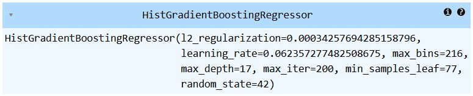

# <center><i>Kaggle Challenge </i></center>

# <center>BackPack Prediction Challenge [link](https://www.kaggle.com/competitions/playground-series-s5e2)</center>

## Challenge Objective

The goal of the Tabular Playground Series is to provide the Kaggle community with a variety of fairly light-weight challenges that can be used to learn and sharpen skills in different aspects of machine learning and data science. The duration of each competition will generally only last a few weeks, and may have longer or shorter durations depending on the challenge. The challenges will generally use fairly light-weight datasets that are synthetically generated from real-world data, and will provide an opportunity to quickly iterate through various model and feature engineering ideas, create visualizations, etc.

---

## About the Dataset 📊

This dataset contains 50,000 records of student bags, including various features that are relevant for predicting the price of a bag. The dataset is intentionally designed with duplicates, missing values, and noise to provide a realistic scenario for data cleaning, preprocessing, and exploratory data analysis (EDA) tasks.

- Download the dataset from here: [Kaggle Dataset](https://www.kaggle.com/datasets/souradippal/student-bag-price-prediction-dataset)

## Dataset Features

- `Brand` - The brand of the bag (e.g., Nike, Adidas, Jansport)
- `Material` - The primary material used (e.g., Leather, Polyester, Nylon, Canvas)
- `Size` - The size of the bag (Small, Medium, Large)
- `Compartments` - The number of compartments in the bag (1 to 10)
- `Laptop Compartment` - Whether the bag has a laptop compartment (Yes/No)
- `Waterproof` - Whether the bag is waterproof (Yes/No)
- `Style` - The style of the bag (Backpack, Messenger, Tote) The color of the bag (e.g., Black, Blue, Red, Green, Gray, Pink)
- `Color` - The color of the bag (e.g., Black, Blue, Red, Green, Gray, Pink)
- `Weight Capacity` - The maximum weight the bag can hold
- `Price` - The price of the bag in USD
  <br>

## Best Model 🤖

<div style="text-align:center;">
    <div style="display:inline-block; margin: 20px;">
        <h3>Histogram based Gradient Boosting Regressor</h3>
        
    </div>
</div>

## How to Set Up This Project 🛠️

This guide walks you through setting up the project's environment.

**1. Install Python 🐍**

If you don't have Python installed yet, head over to the official download page: [Python Download Guide](https://wiki.python.org/moin/BeginnersGuide/Download) and follow the instructions for your operating system (Windows, macOS, or Linux).

**<u>Optional: Creating a Virtual Environment</u>**

1. Create a virtual environment:

   In the terminal and run this command:

   ```bash
   python -m venv venv
   ```

2. Activate the virtual environment:

   To activate the virtual environment:

   ```bash
   venv\Scripts\activate
   ```

**2. Download the Repo 📥**

1. Open your Git client or terminal.
2. Navigate to the directory where you want to clone the repository.
3. Run the following command, replacing `<repository_url>` with the actual URL of the project's repository:

```bash
git clone <repository_url>
```

**3. Install required Dependencies 📦**

1. Open terminal/cmd.
2. navigate to repo directory
3. Run the following command to install dependencies from requirements.txt:

```bash
pip install -r ./backpack-prediction/requirements.txt
```
